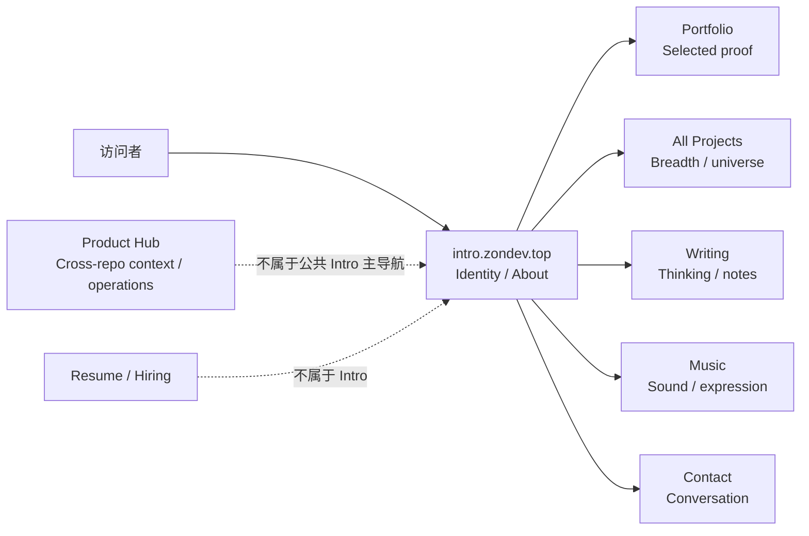
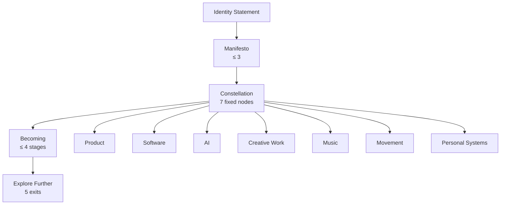
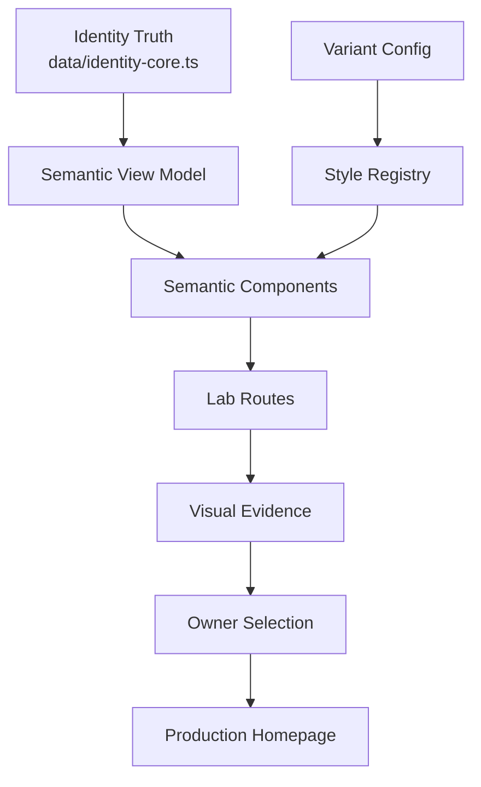
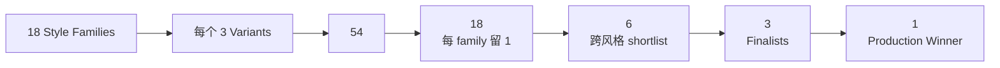
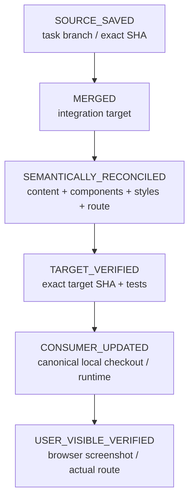
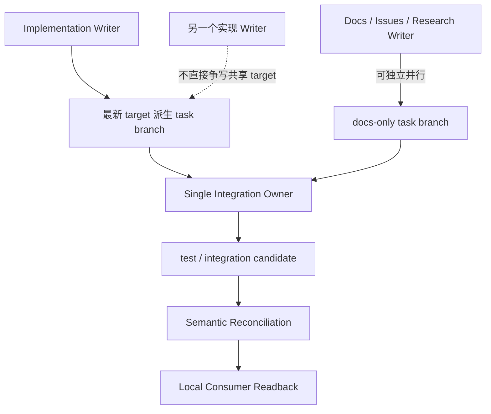

# intro.zondev.top Identity Surface — 目标架构

> 更新时间：2026-09-18  
> Canonical Issue：https://github.com/EOMZON/intro-zondev-top/issues/1  
> Cross-repo Context：https://github.com/EOMZON/creationos-os/issues/132  
> Visual Exploration：https://github.com/EOMZON/intro-zondev-top/blob/docs/intro-identity-visual-exploration-20260917/docs/design/2026-09-18-intro-identity-visual-exploration.md  
> Git Governance：https://github.com/EOMZON/codex-skills-private/blob/9a8e385ccc98f068b0990133f9a2e80681ffa9ec/github-ops/references/test-main-governance.md  
> Merge Reconciliation：https://github.com/EOMZON/codex-skills-private/issues/29

## 1. 目标

`intro.zondev.top` 只承担 Personal Identity / About surface。

它不承担 Resume、Portfolio、Linktree、项目索引、求职落地页、Product Hub 的职责。

核心结果：

> 用极少信息让访问者理解 Zon 长期兴趣之间的关系，然后进入更深层 surface。

## 2. 产品边界



## 3. Identity 内容模型



固定内容预算：

| 内容 | 上限 |
|---|---:|
| Hero supporting copy | ≤45 English words / ≤80 中文字 |
| Manifesto | ≤3 条 |
| Constellation | 7 nodes exactly |
| Becoming | ≤4 stages |
| Primary exits | 5 exactly |
| Visible project names | 0 |
| Visible employer names | 0 |
| KPI / achievement metrics | 0 |

## 4. 软件架构

目标不是 54 套页面，而是一套语义结构 + 一个视觉实验系统。



建议目录：

```text
data/
  identity-core.ts

components/
  identity/
    IdentityShell.tsx
    IdentityHero.tsx
    Manifesto.tsx
    Constellation.tsx
    Becoming.tsx
    ExitLinks.tsx

experiments/
  identity-visual/
    registry.ts
    styles/
    variants/

app/
  lab/
    identity/
      page.tsx
      [style]/
        [variant]/
          page.tsx
```

## 5. Visual Atlas



三个 finalist 应尽量覆盖：

- Personal Manifesto-first
- Constellation-first
- Becoming-first

## 6. Worktree / Merge / Consumer 架构

本项目不允许把“远端分支已提交”误报为“用户本机已拿到”。



Visual coherent set 至少包括：

```text
visual contract
+ identity content model
+ style/variant registry
+ semantic components
+ page/route
+ tests
+ screenshot evidence
```

任何一步缺失，都不能宣称“完整交付”。

## 7. Writer 模型



规则：

1. docs-only 可以云端独立推进；
2. 真正代码实现前必须读本机 worktree / active writer 状态；
3. 一个 integration owner 串行吸收；
4. target 前进后旧测试证据失效，需要重验受影响组合；
5. 不为减少 worktree 数量强制把半成品混入 target；
6. 不用 `merge exit 0` 代替 semantic reconciliation。

## 8. Production Stop Line

在 owner 选定最终方向之前：

- 不替换 `/`；
- 不把 experiment switcher 暴露给生产用户；
- 不合 main；
- 不部署；
- 不把 candidate 叫 final；
- 不把 docs branch 叫 consumer updated。

最终 production 只保留一个清晰 winner。
